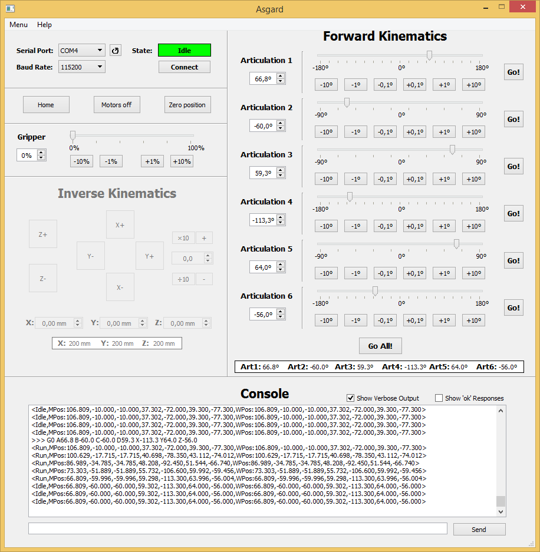

# Asgard

Asgard is a Graphical User Interface (GUI) for [Thor](https://github.com/AngelLM/Thor) designed and programmed with [PyQt5](https://riverbankcomputing.com/software/pyqt/download5).

* Key features:
  *  User-friendly Graphical Interface
  *  Forward Kinematics implementation (1st version)
  *  Inverse Kinematics implementation (2nd version) - *Coming soon*
  *  Sequence Programmer (3rd version) - *Coming soon*
* Some things that I would want to add, but not in the short-term:
  * 3D display
  * 3D IK Controller/Sequence Programmer

## Tools and useful links
* **QtDesigner** - Used to design the graphical part of gui
* **Python 3.4** - Used to program and execute Asgard
+ **[SKYLOGIC PROJECTS Tutorial](http://projects.skylogic.ca/blog/how-to-install-pyqt5-and-build-your-first-gui-in-python-3-4/)** - How to Install PyQt5 and Build Your First GUI in Python 3.4

## Thanks!

* **[Stack Overflow Community](https://stackoverflow.com/)**: And not only related to this project, but also for having all the answers to all questions I had since I started programming.
* **[Harrison Kinsley](https://twitter.com/Sentdex)** ([sentdex](https://www.youtube.com/user/sentdex) from [pythonprogramming.net](https://pythonprogramming.net)): I learned from you almost everything I know about python. Thanks for that detailed tutorials & examples!
* **[Matthew Dirks](https://github.com/skylogic004)** from [SkyLogic](http://projects.skylogic.ca): Thank you for [this detailed tutorial](http://projects.skylogic.ca/blog/how-to-install-pyqt5-and-build-your-first-gui-in-python-3-4/)! It was incredible easy to make my first GUI in less than an hour following your steps!
* **[Thor Community](https://groups.google.com/forum/#!forum/thor-opensource-3d-printable-robotic-arm)**: For all the support and feedback given! YOU ROCK GUYS!

Do not hesitate on contributing to this project!

## License 

All files included in this repository are licensed under a [Creative Commons Attribution-ShareAlike 4.0 International License](http://creativecommons.org/licenses/by-sa/4.0/)
